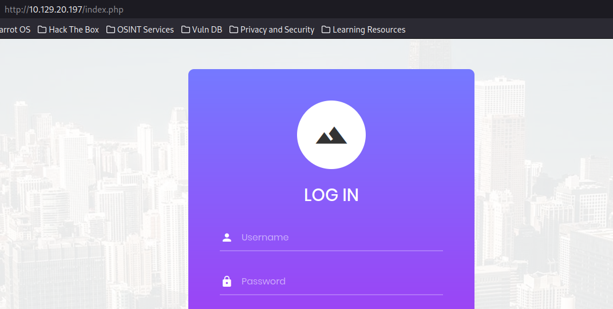
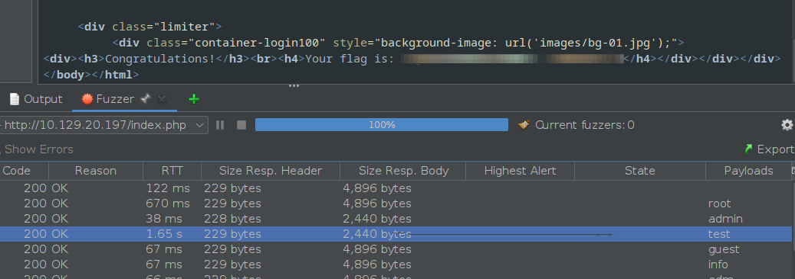

# Appointment Writeup

TAGS: Databases, Apache, MariaDB, PHP, SQL, Reconnaissance, SQL Injection

------------------------------------------------------------------------------------------------
Starting with first step of reconnaissance, port scanning. 
Basic scans will get this result (To lower risk of detection, passive scan -sS flag can also be used):


This shows that port 80(http) is open, we can assume that this is likely to have a webpage. This assumption can also be used if the port is 443, 8080, or 8000.
Now to confirm, version scan using nmap -sV:


From version scan we gather that it is Apache server version 2.4.38. With version specified, we can use this information to search for vulnerability (for example: using searchsploit)


We cannot find anything that will help in searchsploit.

For the next part, let's explore the webpage. 
We can check two of the most popular web directories /index.php and /admin.php if it exist or not.




In landing page of /index.php, it presents us with log-in form.

With this information from only log-in page, this is not enough to plan our approach. As we can see there's no links other "Forgot Password" which doesn't link to anywhere, and Login button. With this we'll need perform brute-force directory enumeration, to gather little more information. This can be done many in ways (Gobuster, Burpsuit, OWASP ZAP) but for the sake of simplicity, we'll be using ffuf. (Wordlist is from [Seclist](https://github.com/danielmiessler/SecLists/blob/master/Discovery/Web-Content/directory-list-2.3-small.txt))
```
ffuf -w /usr/share/dirbuster/wordlists/directory-list-2.3-small.txt -u http://10.129.20.197/FUZZ -t 5
```


From fuzzed directories, we didn't found anything special except main.js. (Which can be easily found in webpage source Ctrl+U)


This Javascript shows validation method without any obfuscation techniques. This shows us what the front-end will accept, and filters out some of our input.

Now we'll attempt to bypass the login page. As we do not have much info, the easiest technique to get everything going is to bruteforce (again), but with a twist. We'll attempt do SQLi, trying to inject our code to bypass password checking. One of the most basic way to do this is to inject the code in the way that comments out the original php code, this can be done by using # which will comments everything out after it for one line.

So we'll be using OWASP ZAP to bruteforce the username, while using # to comment out password check.


(%27=', %23=#); (Wordlist: [Seclist/Usernames](https://github.com/danielmiessler/SecLists/tree/master/Usernames))



We can see from "Size Resp." that 'test' and 'root' both usernames exist. We can try logging in.


Congratulations!! We bypassed password checking inside the webpage, and got the flag.
